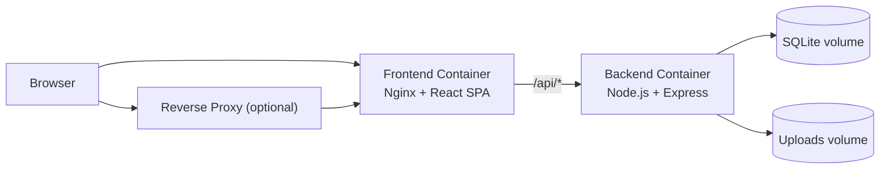

<p align="center">
  
</p>

<h1 align="center">AppLauncher</h1>

<p align="center">
  A self-hosted dashboard for organizing internal links, tools, and services.<br/>
  Direct host-port deployment by default, optional proxy-only deployment over an external reverse-proxy network.
</p>

<p align="center">
  
  
  
  
  
  
  
</p>

---

## Overview

AppLauncher is a lightweight, self-hosted web application for organizing and sharing internal links across a team.

It supports two production-ready deployment modes:

- `docker-compose.yml` for direct access over a published host port
- `docker-compose.proxy.yml` for proxy-only access through an existing reverse-proxy network such as Nginx Proxy Manager

## Key Features

- Visual link dashboard with drag-and-drop group and link ordering
- Admin panel with login, link management, icon uploads, and bookmark import/export
- Per-user favorites via browser fingerprinting
- Dark / light theme with language toggle (EN/DE)
- Build and release metadata in the UI
- Persistent data via named volumes

## Quick Start

### Prerequisites

- [Docker](https://docs.docker.com/engine/install/) with Compose or [Podman](https://podman.io/docs/installation) with `podman compose`

### Option A: Interactive Install Script

```bash
git clone <your-repository-url>
cd AppLauncher
bash install.sh
```

The script creates a direct-access `.env`, starts `docker-compose.yml`, and prints the local URL.

### Option B: Direct Host-Port Deployment

Use this when the app should be reachable directly on the VM or host.

```bash
git clone <your-repository-url>
cd AppLauncher
cp .env.example .env
```

Set at least:

```env
JWT_SECRET=PASTE_A_RANDOM_64_CHAR_HEX_STRING_HERE
ADMIN_PASSWORD=CHANGE_ME_TO_A_STRONG_PASSWORD
APP_PORT=9020
COOKIE_SECURE=auto
```

Start the stack:

```bash
docker compose up -d --build
```

Default access URL:

```text
http://localhost:9020
```

### Option C: Proxy-Only Deployment

Use this when the app should only be reachable through an existing reverse proxy such as Nginx Proxy Manager.

```bash
git clone <your-repository-url>
cd AppLauncher
cp .env.proxy.example .env
```

Set at least:

```env
JWT_SECRET=PASTE_A_RANDOM_64_CHAR_HEX_STRING_HERE
ADMIN_PASSWORD=CHANGE_ME_TO_A_STRONG_PASSWORD
FRONTEND_URL=https://applauncher.example.com
NPM_NETWORK=nginx-proxy-manager_default
PROXY_FRONTEND_ALIAS=applauncher-frontend
COOKIE_SECURE=true
```

Start the proxy stack:

```bash
docker compose -f docker-compose.proxy.yml up -d --build
```

Important behavior in proxy mode:

- No frontend host ports are published
- The backend is never published to the host
- The frontend joins the external proxy network from `NPM_NETWORK`
- Your reverse proxy must target `PROXY_FRONTEND_ALIAS:80` over that network

For Nginx Proxy Manager, use:

- Forward Hostname / IP: `applauncher-frontend`
- Forward Port: `80`
- Scheme: `http`

If you change `PROXY_FRONTEND_ALIAS`, use that value in NPM instead.

## Configuration

| Variable | Description | Default |
| --- | --- | --- |
| `JWT_SECRET` | Required. Secret for signing auth tokens (min 32 chars). | none |
| `ADMIN_PASSWORD` | Required. Admin login password. | none |
| `APP_PORT` | Host port for direct deployment via `docker-compose.yml`. | `9020` |
| `COOKIE_SECURE` | Cookie security: `auto`, `true`, or `false`. | `auto` in direct mode |
| `FRONTEND_URL` | Public browser URL. Required in proxy mode, optional otherwise. | none |
| `NPM_NETWORK` | External Docker/Podman network shared with your reverse proxy. | none |
| `PROXY_FRONTEND_ALIAS` | Internal DNS alias used by the frontend on the proxy network. | `applauncher-frontend` |
| `DATABASE_PATH` | Optional SQLite path override inside the backend container. | `/app/data/applauncher.db` |
| `UPLOAD_PATH` | Optional upload path override inside the backend container. | `/app/uploads/icons` |
| `BUILD_VERSION` | Optional build/release version override. | auto from root `package.json` |
| `BUILD_DATE` | Optional build timestamp override. | auto from build time in UTC ISO format |
| `GIT_SHA` | Optional Git SHA override. | auto from git when available |
| `BUILD_TIME` | Optional build time override for the version dialog helper. | derived from build timestamp |
| `BUILD_NUMBER` | Optional CI build number override. | git commit count or CI metadata when available |

Notes:

- `COOKIE_SECURE=auto` honors `X-Forwarded-Proto` when present and otherwise follows the incoming request.
- In proxy mode, `FRONTEND_URL` should be the exact external HTTPS URL served to users.
- `docker-compose.proxy.yml` intentionally has no `ports:` section for the frontend.
- Version metadata is derived automatically during image build from root `package.json`, git metadata, and the UTC build timestamp.
- `BUILD_VERSION`, `BUILD_DATE`, and `GIT_SHA` remain supported as optional overrides only; normal installs do not need them in `.env`.
- `.git` is intentionally included in the Docker build context so VM builds from a cloned repository can embed the current commit SHA automatically.
- If the build context has no `.git` directory, the app still derives the version from `package.json`; Git SHA falls back to `unknown`.
- The frontend reads `/runtime-config.js` first and falls back to `/api/version`, so version metadata stays correct across direct and proxy deployments.

## Architecture



- `docker-compose.yml` is the direct host-port stack.
- `docker-compose.proxy.yml` is the proxy-only stack.
- The backend is not published to the host in either mode.
- Database and uploads live in named volumes, not bind-mounted project folders.

## Operations

### Update

Direct mode:

```bash
docker compose up -d --build
```

Proxy mode:

```bash
docker compose -f docker-compose.proxy.yml up -d --build
```

### Stop

Direct mode:

```bash
docker compose down
```

Proxy mode:

```bash
docker compose -f docker-compose.proxy.yml down
```

### Logs

Direct mode:

```bash
docker compose logs -f
```

Proxy mode:

```bash
docker compose -f docker-compose.proxy.yml logs -f
```

### Verify Deployed Version

Direct mode:

```bash
curl http://localhost:9020/api/version
```

Proxy mode:

```bash
curl https://applauncher.example.com/api/version
```

Expected response shape:

```json
{
  "version": "v2.1.0",
  "buildDate": "2026-04-10T06:13:29.061Z",
  "gitSha": "585a97c"
}
```

The same metadata is also exposed in the UI through `runtime-config.js` and the version dialog in the dock.

### Backup

```bash
./backup.sh
```

Creates a timestamped `.tar.gz` from the named database and uploads volumes.

### Restore

```bash
./restore.sh backups/applauncher_backup_20260409_120000.tar.gz
```

Non-interactive restore:

```bash
./restore.sh --yes backups/applauncher_backup_20260409_120000.tar.gz
```

The restore script stops the running stack, restores both volumes, and leaves the final startup to your chosen compose command.

## Local Development

Requires **Node.js 22+**.

```bash
npm install
npm run dev
```

Useful commands:

```bash
npm run build
npm run lint
npm test
```

## Project Structure

```text
backend/                 Express API, SQLite, auth, routes
frontend/                React SPA
docker/                  Container entrypoints
nginx/                   Example host-level reverse proxy config
docker-compose.yml       Direct host-port stack
docker-compose.proxy.yml Proxy-only stack for external reverse-proxy networks
Dockerfile.backend       Backend multi-stage build
Dockerfile.frontend      Frontend build + Nginx runtime
install.sh               Interactive direct-mode setup
backup.sh                Volume backup script
restore.sh               Volume restore script
.env.example             Direct deployment example
.env.proxy.example       Proxy deployment example
```

## Reverse Proxy Notes

AppLauncher does not require a reverse proxy to run. Use `docker-compose.yml` for direct access, or `docker-compose.proxy.yml` when the app should only be reachable through an external proxy network.

When switching between direct and proxy mode, stop the currently running stack first so Compose can recreate the containers with the correct network and port model.

If you prefer a host-level reverse proxy instead of Docker-network attachment, point your host proxy at `http://127.0.0.1:<APP_PORT>`.

## Security

- Admin sessions use JWT tokens stored in HTTP-only cookies
- State-changing admin requests are restricted to trusted same-origin browser requests
- Rate limiting on login attempts
- HTML input is sanitized server-side via `sanitize-html`
- File uploads are restricted to image types with size limits
- The backend is not published to the host
- The app refuses to start with weak credentials in production mode

## External Services

- The dashboard itself is self-hosted
- The weather widget fetches forecast data from Open-Meteo
- Icon library search can use Iconify's public API
- Google Fonts are loaded by the frontend stylesheet in the current design

## License

[MIT](LICENSE)
