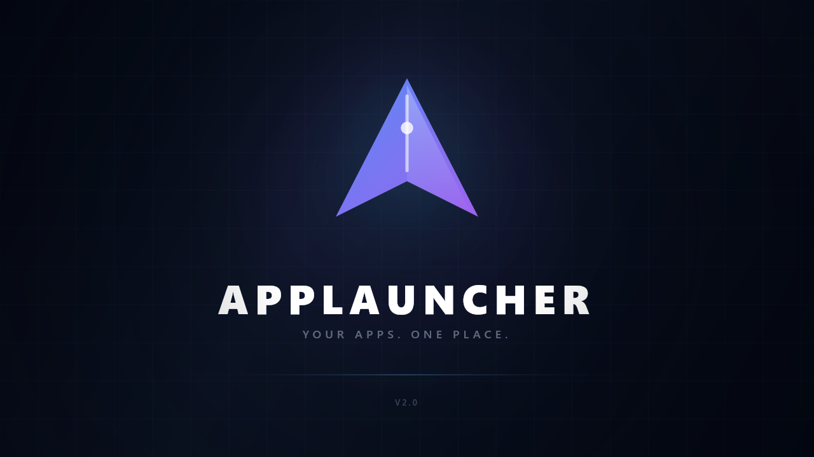
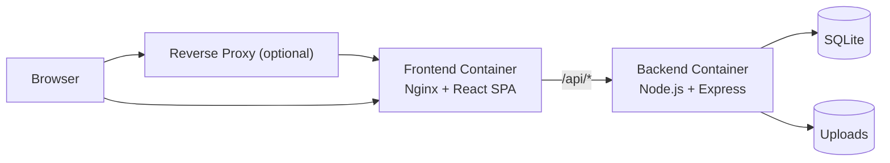

<p align="center">
  
</p>

<h1 align="center">AppLauncher</h1>

<p align="center">
  A self-hosted dashboard for organizing internal links, tools, and services.<br/>
  Deploy anywhere with Docker — no hardcoded URLs, no vendor lock-in.
</p>

<p align="center">
  
  
  
  
  
  
  
</p>

---

## Overview

AppLauncher is a lightweight, self-hosted web application for organizing and sharing internal links across a team. It runs as a Docker stack with zero external dependencies — just bring your own container runtime.

**Key features:**

- Visual link dashboard with drag-and-drop group and link ordering
- Admin panel with login, link management, icon uploads, and bookmark import/export
- Per-user favorites via browser fingerprinting (no accounts needed for viewers)
- System info widget with rich-text editor
- Dark / light theme with language toggle (EN/DE)
- Automatic build versioning from Git history
- Persistent data via Docker volumes — survives container rebuilds

## Preview

<p align="center">
  
</p>

## Quick Start

### Prerequisites

- [Docker](https://docs.docker.com/engine/install/) with Compose **or** [Podman](https://podman.io/docs/installation) with podman-compose

### Option A: Interactive Install Script

```bash
git clone https://github.com/marcodessi-equinix/AppLauncher.git
cd AppLauncher
bash install.sh
```

The script auto-detects Docker or Podman, generates a secure `.env`, builds the containers, and prints the access URL.

### Option B: Manual Setup

```bash
git clone https://github.com/marcodessi-equinix/AppLauncher.git
cd AppLauncher
cp .env.example .env
```

Edit `.env` — copy this template and fill in your values:

```env
# ── Required ──────────────────────────────────
JWT_SECRET=PASTE_A_RANDOM_64_CHAR_HEX_STRING_HERE
ADMIN_PASSWORD=CHANGE_ME_TO_A_STRONG_PASSWORD

# ── Reverse Proxy ─────────────────────────────
# Name of your proxy's Docker network (find with: docker network ls)
NPM_NETWORK=nginx-proxy-manager_default

# ── Optional (defaults shown) ─────────────────
# APP_PORT=9020
# COOKIE_SECURE=auto
# FRONTEND_URL=https://applauncher.example.com
```

> **Tip:** Generate a secure JWT secret with: `openssl rand -hex 32`

Then start the stack:

```bash
docker compose up -d --build
```

The app will be available at **http://localhost:9020** (or whatever you set `APP_PORT` to).

### Option C: Portainer / Stack Manager

1. Create a new stack from this Git repository.
2. Set the compose file to `docker-compose.yml`.
3. Add environment variables:
   - `JWT_SECRET` — a random 64-char hex string
   - `ADMIN_PASSWORD` — your admin password
   - `NPM_NETWORK` — name of your reverse proxy's Docker network (e.g. `nginx-proxy-manager_default`)
   - `COOKIE_SECURE` — set to `true` if your proxy terminates SSL
4. Deploy.
5. In NPM, create a proxy host: hostname `applauncher-frontend`, port `80`, scheme `http`.

## Configuration

All configuration is done via environment variables. Copy `.env.example` to `.env` and adjust as needed.

| Variable | Description | Default |
| --- | --- | --- |
| `JWT_SECRET` | **Required.** Secret for signing auth tokens (min 32 chars). | — |
| `ADMIN_PASSWORD` | **Required.** Admin login password. | — |
| `APP_PORT` | Host port the app listens on. | `9020` |
| `COOKIE_SECURE` | Cookie security: `auto`, `true`, or `false`. | `auto` |
| `NPM_NETWORK` | Docker network name of your reverse proxy (see [Reverse Proxy](#reverse-proxy)). | `nginx-proxy-manager_default` |
| `FRONTEND_URL` | Optional public URL for stricter origin matching behind proxies. | — |

> **Note:** `COOKIE_SECURE=auto` detects HTTPS via `X-Forwarded-Proto`. If your reverse proxy does not forward this header, set `COOKIE_SECURE=true` explicitly when using HTTPS.

## Architecture



- **Frontend** serves the React SPA via Nginx and reverse-proxies `/api/` and `/uploads/` to the backend.
- **Backend** is only reachable inside the Docker network — never exposed to the host.
- **Data** is stored in named Docker volumes, persisting across rebuilds.

## Tech Stack

| Layer | Technology |
| --- | --- |
| Frontend | React 19, Vite 7, TypeScript, Zustand, React Query |
| UI | Tailwind CSS, Radix UI, Lucide Icons, dnd-kit |
| Backend | Node.js 22, Express 5, TypeScript, Zod |
| Database | SQLite (via built-in `node:sqlite`) |
| Web Server | Nginx (Alpine) |
| Containers | Docker Compose / Podman Compose |

## Operations

### Update

```bash
git pull
docker compose up -d --build
```

App data is preserved — only the code is rebuilt.

### Stop

```bash
docker compose down
```

### Logs

```bash
docker compose logs -f
```

### Backup

```bash
./backup.sh
```

Creates a timestamped `.tar.gz` of the database and uploaded icons.

### Restore

```bash
./restore.sh backups/applauncher_backup_20260407_120000.tar.gz
```

Stops the stack, restores data, then you restart manually.

## Local Development

Requires **Node.js 22+**.

```bash
npm install
npm run dev
```

This starts the backend (with hot-reload) and the Vite dev server concurrently. Default dev credentials:

- Admin password: `1234`
- JWT secret: auto-generated dev default

### Useful Commands

```bash
npm run build        # Build both frontend and backend
npm run test         # Run backend tests
npm run lint         # Lint frontend
```

## Project Structure

```
├── backend/              # Express API, SQLite, auth, routes
│   └── src/
│       ├── app.ts        # Server entry point
│       ├── db/           # Database init & migrations
│       ├── routes/       # API route handlers
│       ├── controllers/  # Request handlers
│       ├── services/     # Business logic
│       └── middleware/    # Auth middleware
├── frontend/             # React SPA
│   ├── nginx.conf        # Production nginx config
│   └── src/
│       ├── components/   # UI components
│       ├── lib/          # API client, utilities
│       ├── store/        # Zustand state
│       └── types/        # TypeScript types
├── docker/               # Container entrypoints
├── nginx/                # Reference nginx config for host-level proxy
├── docker-compose.yml    # Stack definition
├── Dockerfile.backend    # Backend multi-stage build
├── Dockerfile.frontend   # Frontend build + Nginx runtime
├── install.sh            # Interactive setup script
├── backup.sh             # Data backup script
├── restore.sh            # Data restore script
└── .env.example          # Configuration template
```

## Reverse Proxy

AppLauncher works out-of-the-box with Nginx Proxy Manager (NPM), Traefik, Caddy, or any other reverse proxy.

The frontend container automatically joins your proxy's Docker network so the proxy can reach it directly — no host-port forwarding tricks needed.

### Setup

1. Find your proxy's Docker network name:
   ```bash
   docker network ls
   ```
   Common names: `npm_proxy`, `nginx-proxy-manager_default`, `proxy`.

2. Set `NPM_NETWORK` in your `.env` or Portainer environment:
   ```env
   NPM_NETWORK=nginx-proxy-manager_default
   ```

3. In your proxy manager, create a proxy host:
   - **Forward Hostname / IP:** `applauncher-frontend`
   - **Forward Port:** `80`
   - **Scheme:** `http`
   - **SSL:** request/enable certificate as usual

4. Set `COOKIE_SECURE=true` if your proxy terminates SSL.

> The app is also reachable directly via `http://<host-ip>:<APP_PORT>` (default `9020`) for testing without a proxy.

## Security

- Admin sessions use JWT tokens stored in HTTP-only cookies.
- Rate limiting on login attempts (10 per 15 minutes per IP).
- Exclusive admin session lock — only one admin can be active at a time.
- HTML input is sanitized server-side via `sanitize-html`.
- File uploads are restricted to image types with size limits.
- The backend is never exposed outside the Docker network.
- The app refuses to start with weak credentials in production mode.

## License

[MIT](LICENSE)
